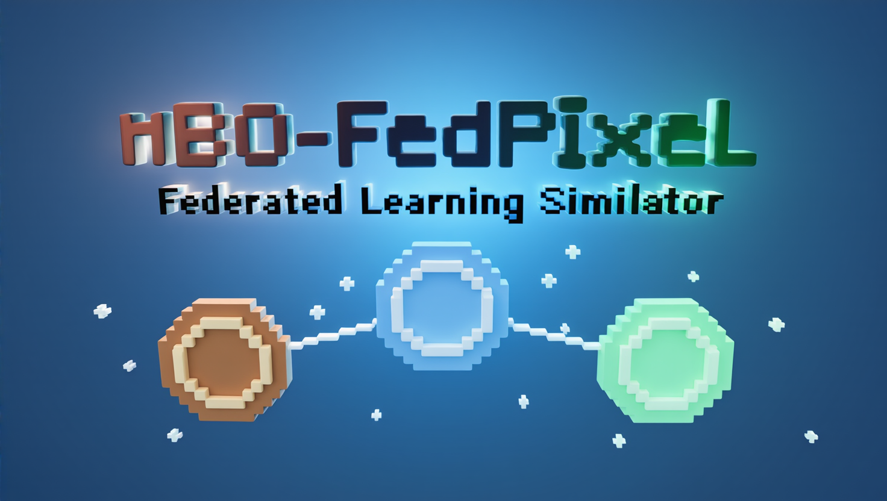

# Federated Generative Agents

[](https://opensource.org/licenses/MIT)
[](https://www.typescriptlang.org/)
[](https://phaser.io/)
[](https://www.python.org/)
[](https://fastapi.tiangolo.com/)
[](https://mesa.readthedocs.io/)
[](https://ollama.ai/)

**Ricercatori autonomi con architettura cognitiva believable in un ecosistema di Federated Learning distribuito: simulazione multi-agente con pipeline cognitiva completa, sistema di memoria a tre livelli, dialoghi LLM-driven role-aware, navigazione A\*, Differential Privacy e analytics in tempo reale.**

<p align="center">
  
</p>

---

## Panoramica scientifica

Federated Generative Agents (FGA) esplora l'intersezione tra **Federated Learning** (McMahan et al., AISTATS 2017), **agenti generativi believable** (Park et al., ACM UIST 2023) e **Privacy-Preserving Machine Learning** (Dwork & Roth, 2014). Il sistema simula un ecosistema di ricerca distribuito in cui agenti autonomi, dotati di ruoli professionali distinti e di una architettura cognitiva completa, collaborano alla costruzione di modelli federati rispettando vincoli di privacy differenziale.

A differenza dei simulatori FL tradizionali (Flower, FedML, PySyft) che trattano i client come nodi computazionali passivi, FGA modella ogni partecipante come un **agente cognitivo** con:

- **Architettura cognitiva a 5 stadi**: percezione, recupero dalla memoria, pianificazione, riflessione e esecuzione — derivata e estesa dal framework di Park et al. (2023) con specializzazione per il dominio FL
- **Sistema di memoria a 3 livelli**: working memory (scratch), memoria episodica a lungo termine (associative memory con ConceptNode), modello spaziale gerarchico (spatial memory tree)
- **Autonomia decisionale**: state machine a 6 stati con decisioni ogni 6-14 secondi, pensieri spontanei, interazioni basate su prossimita e ruolo
- **Dialoghi contestuali**: conversazioni LLM-driven che riflettono la competenza professionale di ciascun ruolo e la relazione specifica tra le coppie di agenti
- **Comportamento spaziale**: navigazione A* su griglia con pathfinding attraverso porte e corridoi
- **Consapevolezza FL**: gli agenti ricevono eventi di Federated Learning iniettati nella loro memoria, riflettono su accuracy, privacy budget, convergenza e generano insight role-specific

### Contributi principali

1. **Cognitive FL Agents**: primo framework che integra agenti con architettura cognitiva completa (perceive-retrieve-plan-reflect-execute) in un contesto di Federated Learning con Differential Privacy
2. **Role-pair dialog system**: 30 dialoghi specifici per 6 coppie di ruoli professionali, con movimento contestuale verso le stanze pertinenti e rispetto della gerarchia accademica
3. **FL Event Injection**: meccanismo di iniezione di eventi FL nella memoria associativa degli agenti, con poignancy scoring differenziato per ruolo, che innesca riflessioni e conversazioni contestuali
4. **Dialog Analytics**: sistema di tracking che registra ogni interazione con 20+ campi (posizioni, prossimita, stanza, categoria, sorgente LLM/stub) e genera report aggregati
5. **Integrazione LLM locale**: generazione dialoghi, pensieri, decisioni, piani e reazioni via Ollama (qwen3.5:4b) con cache, fallback deterministico e stripping automatico dei tag cognitivi

### Domande di ricerca

FGA e progettato per investigare:

- **RQ1**: In che modo le dinamiche sociali tra ricercatori (mentoring, audit, collaborazione) influenzano l'efficacia di un processo di Federated Learning?
- **RQ2**: Come varia il comportamento degli agenti in risposta a eventi FL (convergenza, esaurimento budget privacy, degradazione accuracy)?
- **RQ3**: Quale impatto ha la consapevolezza della Differential Privacy sulle decisioni collaborative degli agenti con ruoli diversi?
- **RQ4**: Le interazioni emergenti tra agenti cognitivi producono pattern qualitativamente diversi rispetto a simulazioni con client passivi?

---

## Architettura

```
                         +------------------+
                         |   Ollama LLM     |
                         |  qwen3.5:4b      |
                         |  port 11434      |
                         +--------+---------+
                                  |
                    +-------------v--------------+
                    |      FastAPI BACKEND        |
                    |      port 8091              |
                    |                             |
                    |  SimulationController       |
                    |   +-- LabEnvironment (Mesa) |
                    |   +-- FederatedLearning     |
                    |   |   (FedAvg, DP-SGD)      |
                    |   +-- CognitivePipeline     |
                    |       (5 stadi + converse)  |
                    |                             |
                    |  9 ResearcherAgents x 3 lab |
                    |  20+ REST + WebSocket /ws   |
                    +-------------+--------------+
                                  |
                    +-------------v--------------+
                    |    React 18 + Phaser 3      |
                    |    FRONTEND port 3026       |
                    |                             |
                    |  WorldMapScene (3 lab, FL)  |
                    |  BaseLabScene               |
                    |   +-- Agent sprites (A*)    |
                    |   +-- DialogPipeline        |
                    |   +-- DialogAnalytics       |
                    |   +-- FLController          |
                    |   +-- LabControlsMenu       |
                    |  Zustand State Store        |
                    +----------------------------+
```

### Stack tecnologico

| Layer | Tecnologia | Dettaglio |
|---|---|---|
| **Frontend** | React 18.2, TypeScript 4.9, Phaser 3.55.2 | Pixel art 2D, zoom zone-based, state management con Zustand |
| **Backend** | FastAPI 0.85, Mesa 1.1, Python 3.11 | Simulazione multi-agente, REST API, FL orchestration |
| **LLM** | Ollama + qwen3.5:4b (4.7B params, Q4_K_M) | Dialoghi, thinking, decisioni, pianificazione, reazioni |
| **Cognitivo** | Pipeline 5 stadi + converse, 50+ prompt functions | Perceive, retrieve, plan, reflect, execute |
| **Memoria** | Scratch + AssociativeMemory + SpatialMemory | Working, episodica (ConceptNode), modello spaziale |
| **FL** | FedAvg + DP-SGD con numpy | Training federato distribuito, privacy differenziale |
| **Ambiente** | Conda `mbo_gai` (/opt/miniconda3) | Python 3.11, porta backend 8091, porta frontend 3026 |

---

## Architettura cognitiva

Ogni agente implementa una pipeline cognitiva a **5 stadi** derivata dal framework di Park et al. (2023) e specializzata per il dominio Federated Learning.

### Pipeline: Perceive - Retrieve - Plan - Reflect - Execute

```
                              Ambiente (Mesa Grid)
                                     |
                          +----------v----------+
                          |     1. PERCEIVE      |
                          |  Rileva eventi nel   |
                          |  raggio di visione   |
                          |  (4 tile, top-3      |
                          |   per bandwidth)     |
                          +----------+-----------+
                                     |
                          +----------v----------+
                          |     2. RETRIEVE      |
                          |  Recupera memorie    |
                          |  rilevanti con peso: |
                          |  recency x relevance |
                          |  x importance        |
                          +----------+-----------+
                                     |
                          +----------v----------+
                          |      3. PLAN         |
                          |  Piano giornaliero   |
                          |  --> orario --> task  |
                          |  Reattivo se evento  |
                          |  ad alta poignancy   |
                          +----------+-----------+
                                     |
                          +----------v----------+
                          |     4. REFLECT       |
                          |  Focal point da      |
                          |  memorie recenti     |
                          |  --> 5 insight con   |
                          |  evidence linking    |
                          +----------+-----------+
                                     |
                          +----------v----------+
                          |     5. EXECUTE       |
                          |  Pathfinding A*      |
                          |  Movimento su griglia|
                          |  Aggiornamento stato |
                          +----------------------+
```

### Sistema di memoria a 3 livelli

| Livello | Struttura | Contenuto | Persistenza |
|---------|-----------|-----------|-------------|
| **Scratch** (working memory) | Dizionario flat | Identita, ruolo, attivita corrente, schedule, posizione, stato FL | In-memory |
| **Associative Memory** (lungo termine) | Lista di ConceptNode | Eventi percepiti, pensieri, conversazioni — con subject-predicate-object, poignancy (1-10), keywords, embedding | In-memory (localStorage frontend) |
| **Spatial Memory** (modello spaziale) | Albero gerarchico | World > Sector > Arena > Game Objects | In-memory |

### ConceptNode (unita di memoria)

Ogni evento, pensiero o conversazione e codificato come un **ConceptNode**:

```
{
  node_id, created, expiration,
  subject, predicate, object,         // tripla semantica
  description, embedding_key,         // per retrieval
  poignancy: 1-10,                    // importanza
  keywords: Set<string>,              // per lookup rapido
  filling: [...]                      // contenuto/chat
}
```

Il **retrieval** combina tre fattori con pesi configurabili:
- **Recency**: decadimento esponenziale dall'ultimo accesso
- **Relevance**: similarita coseno tra embedding della query e del nodo
- **Importance**: poignancy memorizzata al momento della creazione

### FL Event Injection

Quando un round FL si completa, il `SimulationController` inietta eventi nella memoria associativa degli agenti con **poignancy elevata** (7-8) per innescare riflessioni:

- **Professor**: riceve insight su accuracy gain locale vs globale, direzione della ricerca
- **Privacy Specialist**: riceve aggiornamenti su budget epsilon consumato, noise multiplier, compliance
- **Researcher**: riceve metriche di training, loss, convergenza
- **Student**: riceve feedback sul progresso e suggerimenti di apprendimento

Questo meccanismo crea un loop feedback dove gli agenti **ragionano sugli esiti FL** e generano conversazioni contestuali informate dai risultati reali della simulazione.

---

## Agenti e ruoli

### State machine

```
                    makeDecision() [ogni 6-14s]
                           |
            +--------------+--------------+
            |              |              |
            v              v              v
       WALKING         WORKING       DISCUSSING
      (A* path)       (8-16s)       (14-18s, freeze)
            |              |              |
            v              v              v
          IDLE <-----------+--------------+
            |
            +-- spontaneous thoughts (ogni 12-20s idle)
            +-- coffee break (probabilistico)
            +-- findNearbyAgent (raggio 100px, cooldown 15s)
```

**Stati**: IDLE, WALKING, WORKING, MEETING, DISCUSSING, PRESENTING

### Ruoli professionali

| Ruolo | Competenze FL | Comportamento | Interazioni tipiche |
|---|---|---|---|
| **Professor** | Direzione ricerca, supervisione | Mentoring, feedback, strategy | Invita nel suo ufficio, guida meeting |
| **Privacy Specialist** | DP, PPML, audit | Analisi privacy, compliance | Propone analisi al Privacy Lab |
| **Researcher** | Training, sperimentazione | Sviluppo, benchmark | Collabora in Area Ricerca |
| **Student** | Apprendimento, task execution | Studio, implementazione | Segue indicazioni, chiede feedback |
| **Doctor** | Dati clinici, diagnosi | Validazione medica | Verifica qualita dati sanitari |

### Laboratori e agenti

| Laboratorio | Agenti | Specializzazione |
|---|---|---|
| **Universita Mercatorum** | Elena Conti (Prof.), Luca Bianchi (Privacy), Sofia Greco (Researcher), Marco Rossi (Student) | FL con privacy differenziale, PPML |
| **Blekinge University** | 3 agenti | Algoritmi di aggregazione avanzati, ottimizzazione IoT |
| **OPBG IRCCS** | 3 agenti | FL per dati medici sensibili, diagnosi pediatrica federata |

---

## Federated Learning

### Algoritmi implementati

#### FedAvg (McMahan et al., 2017)

Implementazione numpy-only del Federated Averaging con training locale su dati sintetici distribuiti tra i 3 laboratori.

**Ciclo di un round FL (4 fasi, ~200 step totali)**:
```
Training locale (50 step)
  --> Agents train su dati locali (progress: 0.1 x efficiency/step)
Invio modelli (50 step)
  --> Client updates trasmessi all'aggregatore
Aggregazione (50 step)
  --> FedAvg: weighted average dei parametri per numero campioni
Ricezione (50 step)
  --> Modello globale distribuito a tutti i client
  --> Injection eventi FL nelle memorie agenti
  --> Generazione conversazioni FL tra coppie di agenti
```

#### DP-SGD (Abadi et al., 2016)

Integrazione di Differential Privacy nel training locale:

| Parametro | Descrizione | Default |
|---|---|---|
| `epsilon_total` | Budget privacy totale | Configurabile |
| `max_grad_norm` | Clipping dei gradienti | Configurabile |
| `noise_multiplier` | Rumore gaussiano aggiunto | Configurabile |
| `epsilon_spent` | Budget consumato (tracciato per round) | 0.0 |

### Metriche raccolte

| Metrica | Granularita | Uso |
|---|---|---|
| **Accuracy** (locale e globale) | Per round, per lab | Valutazione convergenza |
| **Loss** | Per round, per client | Monitoraggio training |
| **Communication overhead** | Per round | Efficienza comunicazione |
| **Local vs Global accuracy** | Per lab, per round | Impatto della federazione |
| **Cross-evaluation** | Lab x Lab matrice | Generalizzazione del modello |
| **DP budget** | Cumulativo | Rispetto vincoli privacy |

### Convergenza e monitoraggio

Il sistema traccia:
- Stato di convergenza (accuracy target raggiunta)
- Esaurimento del budget privacy
- Round completati vs target
- Gain/loss per singolo laboratorio dalla federazione

---

## Ambienti di laboratorio

### Universita Mercatorum Lab

Layout a **6 stanze** con tilemap procedurale e **38 tipi di tile** generati via canvas:

| Stanza | Floor | Mobili | Funzione |
|---|---|---|---|
| **Ufficio Prof.** | Amber | Scrivania, librerie, lampada, quadro, tappeto | Mentoring, feedback, direzione ricerca |
| **Meeting Room** | Blue | Tavolo centrale, whiteboard, proiettore, sedie | Presentazioni, allineamento progetto |
| **Privacy Lab** | Purple | Scrivanie, server, stampante, libreria | DP analysis, PPML, audit privacy |
| **Break Room** | Warm | Divani, tavolino caffe, frigo, distributore | Pause, socializzazione |
| **Area Ricerca** | Teal | Scrivanie, libreria, stampante, lampada | Sviluppo, sperimentazione |
| **Server Room** | Green | Server rack (x4), UPS (x2), monitor, equipment | Monitoraggio training, diagnostica |

### Tileset procedurale

Il sistema genera **38 tipi di tile** a runtime tramite HTML5 Canvas, organizzati in una griglia 8x5:

| Row | Tile |
|---|---|
| **0** | Empty, Floor, Floor Alt, Wall, Wall Horiz, Desk, Bookshelf, Server |
| **1** | Table, Plant, Rug, Whiteboard, Chair, Door, Equipment, Window |
| **2** | Floor edges (T/B/L/R), Wall corner, Cabinet, Monitor, Couch |
| **3** | Floor Meeting/Break/Server/Internal, Floor Prof/Privacy/Research |
| **4** | Lamp, Painting, Projector, Coffee Table, Fridge, Vending, Printer, UPS |

Tre temi cromatici: **Mercatorum** (terracotta), **Blekinge** (ghiaccio scandinavo), **OPBG** (verde clinico).

### Blekinge University Lab

Design scandinavo minimalista. Specializzazione: algoritmi di aggregazione avanzati, ottimizzazione IoT. Layout base, previsto arricchimento con stanze IoT/networking e mobili tematici.

### OPBG IRCCS Lab

Stile clinico child-friendly. Specializzazione: FL per dati medici sensibili, diagnosi pediatrica federata. Layout base, previsto arricchimento con stanze pediatriche e equipment medico.

---

## Sistema di dialoghi

### Pipeline

```
Agent.makeDecision()
    |
    v  emit('agent-interaction')
DialogEventHandler.handleAgentInteraction()
    |
    +-- LLM available? --> Ollama qwen3.5:4b
    |       |
    |       +-- generateAgentThinking(agent1) --> <think>...</think>
    |       +-- generateAgentDialog(agent1)   --> dialog text
    |       +-- generateAgentThinking(agent2) --> <think>...</think>
    |       +-- generateAgentDialog(agent2)   --> response text
    |
    +-- Fallback (probabilistic):
        |-- 35%  Role-pair dialog (context-aware per coppia ruoli)
        |-- 10%  Greeting (10 coppie round-robin)
        |-- 10%  Coffee break --> move to Break Room
        |-- 10%  Meeting room --> move to Meeting Room
        |-- 10%  Server room --> move to Server Room
        |-- 25%  Topical (15 frasi per ruolo, round-robin)
    |
    v
DialogRenderer --> SpeechBubble (question: blue, response: teal)
    |                + ThoughtBubble (muted)
    |                + DecisionBubble (colored)
    |                + Visual effects (particles per tipo)
    v
DialogAnalytics --> record con 20+ campi per interazione
```

### Tipi di evento cognitivo gestiti

| Evento | Trigger | Output |
|---|---|---|
| `agent-interaction` | Due agenti vicini | Dialogo bidirezionale |
| `agent-thinking` | Idle spontaneo (12-20s) | Pensiero in ThoughtBubble |
| `agent-decision` | Ciclo cognitivo | Decisione in DecisionBubble |
| `agent-planning` | Inizio giornata/task | Piano in ThoughtBubble |
| `agent-reaction` | Evento FL o percezione | Reazione contestuale |
| `fl-event` | Round FL completato | Dialogo FL tra coppie |
| `coffee-break` | Probabilistico | Movimento verso Break Room |
| `go-to-room` | Dialogo con destinazione | Pathfinding verso stanza |

### Role-pair dialogs

Ogni coppia di ruoli ha **5 dialoghi specifici** con stanza destinazione e speaker order coerente con la gerarchia:

| Coppia | Tema | Stanza | Speaker |
|---|---|---|---|
| Professor + Privacy Specialist | Differential Privacy, PPML, epsilon budget | Privacy Lab | Privacy Spec. propone |
| Professor + Researcher | Paper review, metodologia, risultati | Meeting Room | Professor guida |
| Professor + Student | Mentoring, feedback tesi, task assignment | Ufficio Prof. | Professor invita |
| Researcher + Privacy Specialist | Budget epsilon, DP integration, audit | Privacy Lab | Researcher chiede |
| Researcher + Student | Benchmark, coding collaborativo, training | Area Ricerca | Researcher guida |
| Privacy Specialist + Student | Insegnamento DP, attacchi, clipping | Privacy Lab | Privacy Spec. insegna |

### Conversazioni FL generate

Dopo ogni round FL, il controller genera conversazioni tra coppie di agenti con contesto reale:
- Numero round corrente
- Accuracy locale vs globale e gain/loss dalla federazione
- Budget DP consumato (se attivo)
- Demografia del laboratorio (eta media, campioni, distribuzione)

Le conversazioni sono generate in parallelo (ThreadPoolExecutor) e iniettate nella memoria come eventi ad alta poignancy.

### Persistenza e freeze

- **Durata bolla**: `8000 + text.length * 50` ms (max 18000ms)
- **Freeze agente**: l'agente si ferma finche il dialogo non scompare (`hasBubble` flag)
- **Avvicinamento**: se distanza > 50px, l'agente cammina verso l'interlocutore prima di parlare
- **Offset risposta**: la bolla di risposta e posizionata -80px (vs -40px per la domanda) per evitare sovrapposizione

---

## Dialog Analytics

Sistema di tracking integrato che registra ogni interazione con metadati completi per analisi quantitativa e qualitativa.

### Dati registrati per ogni dialogo

| Campo | Descrizione |
|---|---|
| `speakerId`, `speakerName`, `speakerRole` | Identita del parlante |
| `targetId`, `targetName`, `targetRole` | Identita del destinatario |
| `speakerPos`, `targetPos` | Coordinate (x, y) al momento del dialogo |
| `speakerRoom`, `targetRoom` | Stanza rilevata per ciascun agente |
| `distance` | Distanza in pixel tra i due agenti |
| `sameRoom` | Se i due agenti sono nella stessa stanza |
| `dialogCategory` | greeting, coffee_break, meeting_room, server_room, role_pair, topical, thinking, state_phrase, llm |
| `isResponse` | Se e una risposta a un dialogo precedente |
| `isLLM` | Se generato da LLM o da fallback deterministico |
| `destinationRoom` | Stanza destinazione se il dialogo innesca movimento |

### Report aggregato

Accessibile dal menu **Controlli Lab > Analytics > Report Dialoghi**:

- **Per categoria**: distribuzione percentuale dei tipi di dialogo
- **Per agente**: conteggio totale, come iniziatore vs target
- **Per coppia di ruoli**: frequenza, distanza media, % stessa stanza
- **Per stanza**: dove avvengono i dialoghi
- **Prossimita**: media, min, max, mediana distanza tra agenti
- **Movimenti innescati**: quante volte ogni stanza e stata destinazione
- **Ultimi 10 dialoghi**: timeline dettagliata

Anche disponibile da console browser: `window.dialogAnalytics.printReport()`

---

## Navigazione A*

Gli agenti navigano attraverso un **pathfinding A\*** su griglia 32px, derivata dal tilemap del furniture layer:

- **Walkable**: pavimento, porte, sedie, tappeti, lampade
- **Blocked**: muri, scrivanie, server, librerie, divani, frigoriferi, UPS, ecc.
- **Heuristic**: distanza Manhattan (4 direzioni, no diagonali)
- **Max iterations**: `grid_size * 2` (safety bound)
- **BFS snap**: se un agente si trova in una cella bloccata, `nearestWalkable()` lo riposiziona
- **No fallback**: se A* non trova un percorso, l'agente resta fermo (no through-wall movement)
- **Output**: lista di waypoint (pixel centers) che l'agente segue frame-by-frame

---

## API Reference

### Simulation Control

| Endpoint | Metodo | Descrizione |
|---|---|---|
| `/simulation/start` | POST | Avvia la simulazione |
| `/simulation/stop` | POST | Arresta la simulazione |
| `/simulation/pause` | POST | Mette in pausa |
| `/simulation/resume` | POST | Riprende dalla pausa |
| `/simulation/reset` | POST | Reinizializza il modello |
| `/simulation/speed?speed=N` | POST | Imposta velocita (float) |
| `/simulation/state` | GET | Snapshot completo dello stato |

### Federated Learning

| Endpoint | Metodo | Descrizione |
|---|---|---|
| `/fl/enable?enabled=true` | POST | Abilita/disabilita FL |
| `/fl/state` | GET | Round, fase, metriche, conversazioni |
| `/fl/algorithm?algorithm=fedavg` | POST | Seleziona algoritmo (fedavg/fedprox) |
| `/fl/data-distribution` | GET | Statistiche dati per lab |
| `/fl/export` | GET | Export completo metriche (JSON) |
| `/fl/convergence` | GET | Stato convergenza e budget |

### LLM Control

| Endpoint | Metodo | Descrizione |
|---|---|---|
| `/llm/toggle?enabled=true` | POST | Abilita/disabilita LLM reale |
| `/llm/status` | GET | Stato LLM + raggiungibilita Ollama |

### AI Generation

| Endpoint | Metodo | Descrizione |
|---|---|---|
| `/ai/status` | GET | Disponibilita Ollama |
| `/ai/generate-dialog` | POST | Genera dialogo agente |
| `/ai/thinking` | POST | Genera pensiero interno |
| `/ai/decision` | POST | Genera decisione FL |
| `/ai/plan` | POST | Genera piano di azione |
| `/ai/reaction` | POST | Genera reazione a evento |

### WebSocket

- **Endpoint**: `ws://localhost:8091/ws`
- **Broadcast**: `simulation_update` ogni 10 step con stato completo (agenti, FL, metriche)
- **Comandi**: `start`, `stop`, `pause`, `set_speed`

---

## Quick Start

### Prerequisiti

- **Node.js** v14+ e npm
- **Python 3.11** via Conda (`conda create -n mbo_gai python=3.11`)
- **Ollama** installato con modello `qwen3.5:4b`

### Setup

```bash
# 1. Installa modello LLM
ollama pull qwen3.5:4b
ollama serve   # lasciare attivo

# 2. Backend
conda activate mbo_gai
cd Researcher_World2/agent-laboratory-v2/backend
pip install -r requirements.txt
python -m uvicorn api.main:app --host 0.0.0.0 --port 8091 --reload

# 3. Frontend (in un altro terminale)
cd Researcher_World2/agent-laboratory-v2/frontend
npm install
npm start    # apre http://localhost:3026

# 4. Attivare LLM nel backend (una tantum)
curl -X POST "http://localhost:8091/llm/toggle?enabled=true"
```

### Verifica stato

```bash
curl http://localhost:11434/api/tags          # Ollama: modelli disponibili
curl http://localhost:8091/                    # Backend: status
curl http://localhost:8091/llm/status          # LLM: enabled + reachable
curl http://localhost:8091/simulation/state    # Simulazione: stato corrente
curl http://localhost:8091/fl/convergence      # FL: convergenza e budget DP
```

---

## Struttura del progetto

```
Researcher_World3_GAI/
+-- README.md
+-- ANALYSIS.md                                  # Analisi architetturale completa
+-- Researcher_World2/
|   +-- agent-laboratory-v2/
|       +-- frontend/                            # React 18 + Phaser 3 (~24,900 righe)
|       |   +-- src/
|       |   |   +-- phaser/
|       |   |   |   +-- scenes/
|       |   |   |   |   +-- BaseLabScene.ts      # Zoom, grid, A*, icons, analytics
|       |   |   |   |   +-- WorldMapScene.ts     # Mappa mondo, miniature lab, FL
|       |   |   |   |   +-- Mercatorum/          # 6-room layout con mobili
|       |   |   |   |   +-- BlekingeLabScene.ts  # Lab Blekinge
|       |   |   |   |   +-- OPBGLabScene.ts      # Lab OPBG IRCCS
|       |   |   |   +-- sprites/
|       |   |   |   |   +-- Agent.ts             # State machine, autonomous behavior
|       |   |   |   |   +-- agentFactory.ts      # Factory pattern per creazione agenti
|       |   |   |   +-- controllers/
|       |   |   |   |   +-- DialogEventHandler.ts    # Pipeline LLM + fallback
|       |   |   |   |   +-- DialogRenderer.ts        # Bubble rendering, role-pair
|       |   |   |   |   +-- DialogAnalytics.ts       # Tracking posizioni e prossimita
|       |   |   |   |   +-- GlobalAgentController.ts # Coordinamento inter-scene
|       |   |   |   +-- fl/
|       |   |   |   |   +-- FLController.ts      # Singleton FL, visual effects
|       |   |   |   |   +-- FLVisualEffects.ts   # Aure, particelle, connessioni
|       |   |   |   +-- utils/
|       |   |   |   |   +-- pathfinder.ts        # A* pathfinding (147 righe)
|       |   |   |   |   +-- tilesetGenerator.ts  # Tileset procedurale (38 tile)
|       |   |   |   +-- ui/
|       |   |   |       +-- SpeechBubble.ts      # Bolle dialogo (question/response)
|       |   |   |       +-- ThoughtBubble.ts     # Bolle pensiero
|       |   |   |       +-- DecisionBubble.ts    # Bolle decisione
|       |   |   |       +-- LabControlsMenu.ts   # Controlli + analytics
|       |   |   +-- components/                  # React UI (9 componenti)
|       |   |   +-- services/api.ts              # REST + WebSocket client
|       |   |   +-- stores/simulationStore.ts    # Zustand state management
|       |   +-- public/assets/                   # Sprite, tileset, icone
|       +-- backend/                             # FastAPI + Mesa (~12,800 righe)
|           +-- api/
|           |   +-- main.py                      # FastAPI, WebSocket, 20+ endpoints
|           |   +-- routes/ai.py                 # Endpoints generazione AI
|           +-- ai/llm_connector.py              # Ollama connector + cache + AgentMemory
|           +-- cognitive/
|           |   +-- perceive.py                  # Percezione eventi nel raggio visivo
|           |   +-- retrieve.py                  # Retrieval pesato (recency/relevance/importance)
|           |   +-- plan.py                      # Pianificazione giornaliera/oraria/task
|           |   +-- reflect.py                   # Riflessione con focal points e insight
|           |   +-- execute.py                   # Esecuzione azioni, pathfinding
|           |   +-- converse.py                  # Generazione conversazioni
|           |   +-- memory/
|           |   |   +-- scratch.py               # Working memory (identita, schedule, FL)
|           |   |   +-- associative_memory.py    # Memoria a lungo termine (ConceptNode)
|           |   |   +-- spatial_memory.py        # Modello spaziale gerarchico
|           |   +-- prompts/
|           |       +-- run_gpt_prompt.py         # 50+ prompt functions + stubs
|           |       +-- gpt_structure.py          # OllamaService singleton, caching
|           +-- models/
|           |   +-- agents/researcher.py         # ResearcherAgent Mesa (9 stati, FL tasks)
|           |   +-- environment.py               # LabEnvironment (9 agenti, 3 lab)
|           |   +-- maze_adapter.py              # Modello spaziale (3 lab x 4 stanze)
|           +-- fl/federated.py                  # FedAvg, DP-SGD, checkpointing
|           +-- simulation/controller.py         # Orchestratore principale
|           +-- tests/                           # 11 file di test (~2,500 righe)
+-- LLM_Generative_Agents/                      # Fork Stanford (Park et al., 2023)
    +-- generative_agents/
        +-- reverie/backend_server/
        |   +-- persona/cognitive_modules/       # perceive, retrieve, plan, reflect, execute
        |   +-- persona/memory_structures/       # spatial, associative, scratch
        +-- environment/frontend_server/         # Django UI (Smallville)
```

---

## Relazione con Stanford Generative Agents

FGA reimplementa l'architettura cognitiva di Park et al. (2023) in una **clean-room port** specializzata per il dominio FL:

| Aspetto | Stanford (2023) | FGA |
|---------|-----------------|-----|
| **Dominio** | Generico (Smallville) | Federated Learning research |
| **LLM** | OpenAI API (cloud, a pagamento) | Ollama locale (gratuito, offline) |
| **FL Integration** | Nessuna | FedAvg, DP-SGD, event injection |
| **Dialoghi** | Generici per personalita | Role-pair specifici per coppia professionale |
| **Analytics** | Nessuno | Tracking completo con 20+ campi per record |
| **Frontend** | Django + tilemap statico | React + Phaser 3 + tileset procedurale |
| **Memoria** | Associative + Spatial + Scratch | Stessa architettura, estesa con campi FL |
| **Prompt** | ~150KB (OpenAI-specific) | ~43KB (refactored, stubs per offline) |

Il fork Stanford e incluso come **riferimento architetturale** nella directory `LLM_Generative_Agents/`. Nessun codice e importato direttamente: FGA e una reimplementazione indipendente.

---

## Stato di sviluppo

| Componente | Stato | Note |
|---|---|---|
| Frontend React + Phaser | Operativo | 81 file, ~24,900 righe, 3 scene lab + world map |
| Tilemap procedurale | Operativo | 38 tile types, 3 temi cromatici |
| A* Pathfinding | Operativo | 4-dir, BFS snap, door/corridor navigation |
| Architettura cognitiva | Operativo | 5 stadi + converse, 50+ prompt functions |
| Sistema di memoria | Operativo | Scratch + Associative (ConceptNode) + Spatial |
| Sistema dialoghi | Operativo | LLM + fallback, 6 role-pair x 5, 8 categorie |
| Dialog Analytics | Operativo | Tracking completo, report UI + console |
| Agent autonomy | Operativo | State machine 6 stati, thoughts, coffee breaks |
| FedAvg | Operativo | numpy, DP-SGD, checkpointing, event injection |
| Ollama LLM | Operativo | qwen3.5:4b, cache, think-tag stripping |
| FL Event Injection | Operativo | Poignancy-scored, role-specific, memory-integrated |
| FL Conversations | Operativo | Parallel generation, context-rich, 3 lab x 3 round |
| Mercatorum Lab | Completo | 6 stanze, 38 tile, mobili, zone, role-pair |
| Blekinge Lab | Base | Layout semplice, da arricchire con stanze tematiche |
| OPBG Lab | Base | Layout semplice, da arricchire con equipment clinico |
| FedProx | Parziale | Endpoint attivo, proximal term da completare in aggregazione |
| DP Budget Enforcement | Parziale | Budget tracciato, enforcement automatico da completare |
| Temporal Memory Decay | Previsto | Scadenza nodi memoria per favorire recency |
| Poignancy Scoring Adattivo | Previsto | Scoring differenziato per ruolo e tipo evento |
| Keyword Strength Tracking | Previsto | Per-agent topic tracking per retrieval adattivo |
| Export Analytics CSV | Previsto | Export dati per analisi statistica esterna (R/Python) |
| Cognitive State Persistence | Previsto | Checkpoint memorie agenti crash-safe su file |

---

## Roadmap scientifica

### Fase 1 — Consolidamento (correttezza sperimentale)

- Enforcement automatico del budget DP (blocco round quando epsilon esaurito)
- Completamento proximal term FedProx per confronto rigoroso con FedAvg
- Checkpoint periodico delle memorie agenti per crash recovery
- Centralizzazione parametri di configurazione (costanti di tuning, intervalli, soglie)

### Fase 2 — Arricchimento cognitivo

- Temporal decay per memorie: nodi ConceptNode con scadenza per favorire conoscenza recente
- Poignancy scoring differenziato per ruolo (Privacy Specialist valuta piu importante un evento DP rispetto a uno Student)
- Keyword strength tracking per agente: tracciamento di quanto ciascun termine FL e saliente per ogni ruolo
- Bidirectional conversation enhancement: generazione LLM full turn-taking con entrambe le prospettive
- Attention bandwidth per ruolo: Professor con percezione piu ampia, Student piu focalizzato

### Fase 3 — Completamento multi-lab

- Blekinge Lab: 6 stanze tematiche (IoT Lab, Networking Room, Nordic Lounge), mobili scandinavi, zone interaction, role-pair per ruoli specifici
- OPBG Lab: stanze cliniche (Pediatric Ward, Data Room, Consultation Room), equipment medico, agenti con ruolo Doctor attivo
- Cross-lab FL conversations: dialoghi tra agenti di laboratori diversi dopo aggregazione globale

### Fase 4 — Analisi e pubblicazione

- Export analytics in CSV/JSON per analisi con R/Python/pandas
- Benchmark: FedAvg vs FedProx su convergence time con agenti autonomi vs passivi
- Metriche quantitative: dialoghi/round, tempo di convergenza, privacy-utility tradeoff
- Studio qualitativo: pattern emergenti nelle interazioni tra ruoli diversi
- Confronto con baseline: simulazione senza architettura cognitiva (client passivi)

---

## Riferimenti

- Park, J.S., O'Brien, J.C., Cai, C.J., Morris, M.R., Liang, P., Bernstein, M.S. (2023). *Generative Agents: Interactive Simulacra of Human Behavior*. ACM UIST 2023. DOI: 10.1145/3586183.3606763
- McMahan, B., Moore, E., Ramage, D., Hampson, S., Arcas, B.A. (2017). *Communication-Efficient Learning of Deep Networks from Decentralized Data*. AISTATS 2017.
- Li, T., Sahu, A.K., Zaheer, M., Sanjabi, M., Talwalkar, A., Smith, V. (2020). *Federated Optimization in Heterogeneous Networks*. MLSys 2020.
- Dwork, C., Roth, A. (2014). *The Algorithmic Foundations of Differential Privacy*. Foundations and Trends in Theoretical Computer Science, 9(3-4):211-407.
- Abadi, M., Chu, A., Goodfellow, I., McMahan, H.B., Mironov, I., Talwar, K., Zhang, L. (2016). *Deep Learning with Differential Privacy*. ACM CCS 2016.
- Kairouz, P., McMahan, H.B., et al. (2021). *Advances and Open Problems in Federated Learning*. Foundations and Trends in Machine Learning, 14(1-2):1-210.
- Bonawitz, K., et al. (2019). *Towards Federated Learning at Scale: A System Design*. MLSys 2019.

---

## Licenza

Questo progetto e rilasciato sotto licenza MIT. Vedi il file [LICENSE](LICENSE) per dettagli.

---

<p align="center">
  <small>&copy; 2025-2026 Fabio Liberti &mdash; Federated Generative Agents Research Project</small>
</p>
